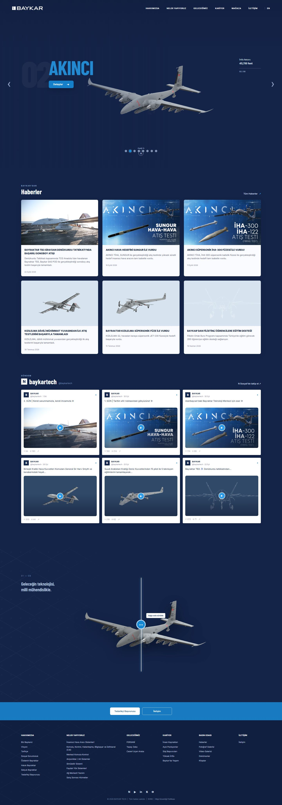

# Baykar Teknoloji — Landing Page Klonu

Baykar Teknoloji’nin Türkçe ana sayfasını referans alan, responsive HTML/CSS/JavaScript klonu.

## Ekran görüntüsü



## Özellikler

- Tam ekran ürün vitrini ve sekiz platform arasında geçiş yapan carousel
- Haber kartları ve sosyal medya akışı
- Sürüklenebilir, klavyeyle de kontrol edilebilen ürün karşılaştırma alanı
- Responsive navigasyon ve mobil menü
- Site footer’ı ve iletişim bağlantıları

## Yerelde çalıştırma

Python ile proje klasöründe basit bir HTTP sunucusu başlatın:

```powershell
python -m http.server 5173
```

Sonra [http://localhost:5173](http://localhost:5173) adresini açın.

> Ürün ve haber fotoğrafları Baykar CDN’inden, yazı tipleri Google Fonts’tan yüklenir. Bunların görünmesi için internet bağlantısı gerekir.

## Dosyalar

- `index.html` — sayfa içeriği ve semantik yapı
- `styles.css` — yerleşim, responsive stiller ve etkileşim geri bildirimleri
- `app.js` — ürün carousel’i, mobil menü ve karşılaştırma kontrolü
- `screenshots/landing-page.jpg` — README’de kullanılan tam sayfa önizleme

